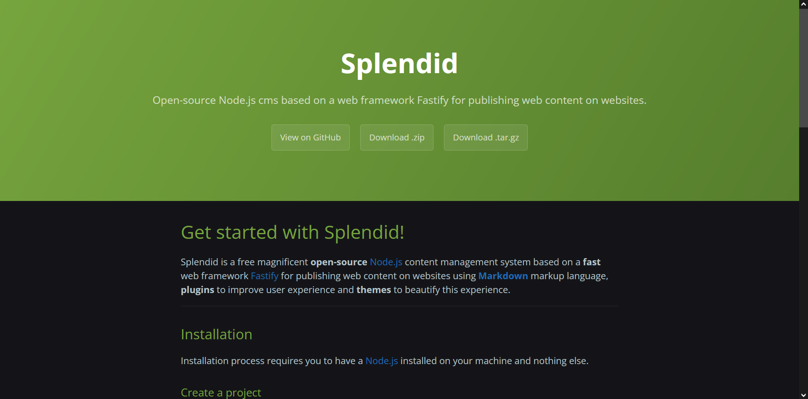

# Get started with Splendid!

Splendid is a free magnificent **open-source** [Node.js](https://nodejs.org/en/) content management system based on a **fast** web framework [Fastify](https://www.fastify.io/) for publishing web content on websites using [**Markdown**](https://en.wikipedia.org/wiki/Markdown) markup language, **plugins** to improve user experience and **themes** to beautify this experience.



---

## Installation

Installation process requires you to have a [Node.js](https://nodejs.org/en/) installed on your machine and nothing else.

### Create a project

**Download** one of two given options above: it can be either [zip](#zip) or [tar.gz](#tar)!

### Deploy the project

**Unarchive** or unzip the fresh downloaded folder in `project` root folder.

### Setup the project

**Checkout** `config.json` in order to configure basic information about the website. It may look like

```json
{
    "Website_name": "Splendid",
    "Theme": "preshow",
    "Icon": "favicon.ico",
    "Port": 3000,
    "Plugins": [],
    "Content": {
        "Header": {
            "Name": "/home/",
            "Github": "https://github.com/splendid-cms"
        },
        "Sidebar": {
            "Page Name": "/link-1/",
            "Category": {
                "Page Name": "/link-2/",
                "Subcategory": {
                    "Page Name": "/link-3/"
                }
            }
        },
        "Footer": "Footer text"
    },
    "Debug": false
}
```

- Where "Website_name" stays for the project name that will be used in header, title etc. (Depends on the theme),
- "Theme" stays for the theme name i.e theme folder name inside the `/content/themes` directory,
- "Icon" for the icon path that will be used in the browser tab (path already starts with `/content/media`),
- "Port" that will be used to server listening,
- "Plugins" for activated plugin names array i.e plugin folder name inside the `/plugins` directory,
- "Content" for the basic content like Header, Sidebar and Footer (Depends on the theme and plugin. Basic version supports these 3),
- "Debug" for logging events.

After all done consider running `npm install` in the terminal in order to install missing dependencies that were used for the Splendid.

### Start the server

It is recommended to use the nodemon starting in order to easily deploy changes without restarting the server. In order to do that use the `npm start` command. If you wish to simply use node command: `node .` or `node views/js/app.js`

---

## Documentation

If you would like to learn more check out more [here](https://github.com/splendid-cms/docs)
